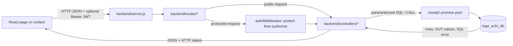
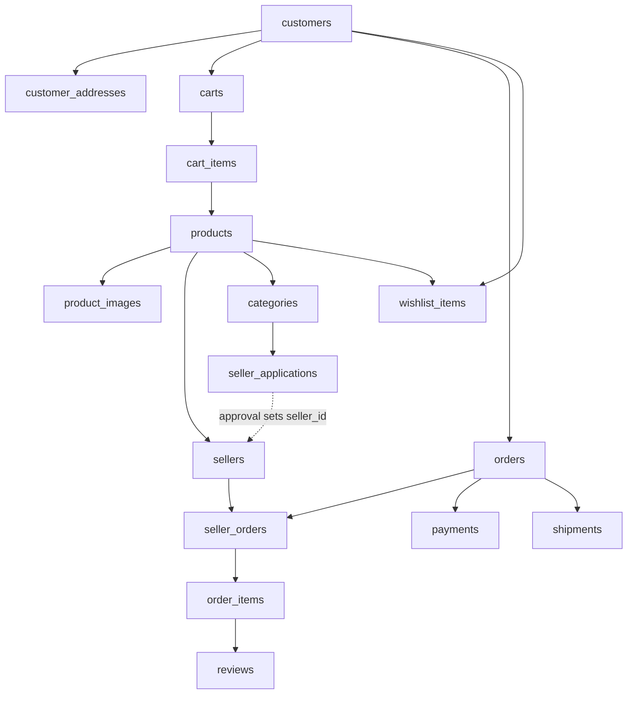

# LogeAchi Backend & Database Defense Walkthrough

This is the implementation-focused companion to [CSE216_EVALUATION_GUIDE.md](CSE216_EVALUATION_GUIDE.md). It follows the real request paths through the frontend, Express routes, controllers, authentication middleware, MySQL pool, tables, stored routines, and triggers. It also calls out places where the checklist description and executable code differ.

Use this as a study guide, not as a claim that every feature is production-complete. In particular, payment processing is simulated, some test scripts have unmet prerequisites, and the current database feature installer can replace the safer checkout procedure with an older version.

## 1. The System in One Picture

The active API is the CommonJS Express application rooted at `backend/server.js`. It uses `backend/routes/`, `backend/controllers/`, `backend/middleware/`, `backend/schemas/`, and `backend/config/db.js`. The `backend/src/` directory currently contains empty scaffold folders; it is not the application imported by `server.js`.



A practical example is login:

```text
Login.jsx
  -> AuthContext.login(...)
  -> POST /api/auth/login
  -> server.js mounts /api/auth
  -> authRoutes.js selects authController.login
  -> authController validates input and queries MySQL
  -> bcrypt compares password_hash
  -> JWT signed with role read from the matching database table
  -> AuthContext stores token/user and sets Axios Authorization header
  -> Login.jsx navigates according to the returned role
```

### Server startup and database access

- [`backend/server.js`](../backend/server.js) loads `.env`, creates Express, enables CORS and JSON parsing, mounts each router at `/api/...`, and runs `SELECT 1` before listening. If MySQL is unavailable or credentials are wrong, the API process exits instead of accepting requests.
- [`backend/config/db.js`](../backend/config/db.js) exports one `mysql2/promise` pool. It reads `DB_HOST`, `DB_PORT`, `DB_USER`, `DB_PASSWORD`, and `DB_NAME`; it allows up to 10 active connections and queues further requests without a configured queue cap.
- `db.execute(sql, values)` and `connection.execute(sql, values)` use placeholders for data values. A `?` is not string concatenation: the SQL structure stays fixed while MySQL receives the value separately. This reduces SQL-injection risk for those values.
- A single read can use the pool directly. A transaction must acquire one connection with `getConnection()` and use that same connection for `beginTransaction`, all statements, and `commit` or `rollback`; otherwise statements might run on different pooled connections.
- Controllers generally catch errors themselves and return JSON. There is no shared Express error-handler middleware in `server.js`.

## 2. Login: From Form to Token

### Successful login path

1. [`frontend/src/pages/Login.jsx`](../frontend/src/pages/Login.jsx) holds the email, password, and selected portal (`customer`, `seller`, or `admin`). The browser performs basic required/email checks. The `role` query string chooses a portal tab; it does not establish a user's real authority.
2. `handleSubmit` calls `AuthContext.login(email.trim(), password, activePortal)`.
3. [`frontend/src/context/AuthContext.jsx`](../frontend/src/context/AuthContext.jsx) posts `{ email, password, role }` to `http://localhost:5000/api/auth/login`.
4. [`backend/server.js`](../backend/server.js) has already mounted `authRoutes` at `/api/auth`. [`backend/routes/authRoutes.js`](../backend/routes/authRoutes.js) maps `POST /login` to `authController.login`. Login is public; it must be public so a user without a token can obtain one.
5. [`backend/schemas/authSchemas.js`](../backend/schemas/authSchemas.js) defines `loginSchema`. Zod trims and validates email, requires a non-empty password, uppercases a supplied role, and only accepts `ADMIN`, `SELLER`, or `CUSTOMER` if a role was supplied.
6. `authController.login` searches the `admins`, then `sellers`, then `customers` table by email. Each table has a different ID column, so the query aliases it to `id` and normalizes the display name to `name`.
7. If an account is found, `bcrypt.compare(plainPassword, user.password_hash)` checks the submitted password against the stored bcrypt hash. The password itself is never compared as plain text and is not returned in the response.
8. If a portal role was supplied, the controller compares it with the role inferred from the table where the account was found. The client cannot turn a customer into an admin by changing the request body.
9. `generateToken` signs `{ id, email, role }` with `JWT_SECRET` and a seven-day expiration. The API returns `{ token, user }`.
10. `AuthContext.login` stores the token and user JSON in `localStorage`, updates Axios's default `Authorization: Bearer <token>` header, and updates React context. `Login.jsx` sends ADMIN to `/admin`, SELLER to `/seller-dashboard`, and CUSTOMER to `/`.

### What stops a failed login?

| Failure point | File/block | Result |
|---|---|---|
| Email/password not entered in the browser | `Login.jsx`, `handleSubmit` | No API request; inline error and toast |
| Malformed email, missing password, invalid role value | `authController.login`, `loginSchema.safeParse` | HTTP `400`; first Zod message plus issue list |
| Email is in none of the three account tables | `authController.login`, `if (!user)` | HTTP `401`, `Invalid credentials` |
| Password does not match bcrypt hash | `authController.login`, `bcrypt.compare` | Same HTTP `401` and message as unknown email, avoiding a direct account-existence distinction |
| Account exists but selected portal does not match database role | `authController.login`, `normalizedRole !== role` | HTTP `403`, portal mismatch message |
| Unexpected database/signing error | `authController.login`, `catch` | HTTP `500`, generic `Server error`; details go to server log |
| API returns any of the above errors | `AuthContext.login` | Returns `{ success: false, message }`; does not store a token or user |
| Login result fails | `Login.jsx`, failed-result branch | Keeps user on login page, shows the response message, does not navigate |

The role query parameter is a portal selector, not a source of truth. The source of truth is the database table match and the role written into the JWT.

### Password and account creation

Customer signup runs through [`frontend/src/pages/Signup.jsx`](../frontend/src/pages/Signup.jsx) and the frontend Zod schema in [`frontend/src/schemas/authSchemas.js`](../frontend/src/schemas/authSchemas.js). That client schema also checks that password and confirmation match. It transforms the body to omit `confirmPassword`, then calls `AuthContext.register`.

On the server:

1. `POST /api/auth/register` reaches `authController.registerCustomer`.
2. `customerRegistrationSchema` validates name, email, password, and optional phone. Password must be at least six alphanumeric characters, with at least one letter and one digit.
3. A `UNION` query checks for the email in customers, sellers, and admins.
4. `bcrypt.genSalt(10)` and `bcrypt.hash` create the stored password hash.
5. The controller acquires one connection and begins a transaction. It inserts the customer and then a cart. Both commit together. If either insert fails, `rollback` removes the partial work.
6. A JWT is signed and returned with HTTP `201`. On duplicate-key error, the API returns `409`.

This demonstrates atomicity: a customer should not be created without the cart row required by the application. The database enforces unique emails within each individual account table, but there is no single cross-table unique constraint. The controller's cross-table check is application-level and is not protected by a shared lock, so an extremely close concurrent registration in different role tables is a design limitation worth acknowledging.

### Logout and protected requests

`POST /api/auth/logout` is protected by `protect`. Once the middleware accepts the token, `authController.logout` extracts it, decodes its expiration, and inserts the whole token into `token_blacklist` with `expires_at`. The browser removes `token` and `user`, clears its Axios default header, and clears React context even if the logout request fails.

For a protected request, [`backend/middleware/authMiddleware.js`](../backend/middleware/authMiddleware.js) does this in order:

1. Require an `Authorization` header beginning with `Bearer`; otherwise return `401 Not authorized, no token`.
2. Extract the token and query `token_blacklist`. A match returns `401 Session expired, please login again`.
3. Call `jwt.verify` with the same secret and expiration rules used by `generateToken`. Invalid, expired, or tampered tokens return `401 Not authorized, token failed`.
4. Put decoded `{ id, email, role }` in `req.user` and call `next()`.
5. If the route also uses `authorize('ROLE', ...)`, that middleware checks `req.user.role`; a mismatch returns `403 Forbidden: Insufficient privileges`.

The backend is the security boundary. Frontend guards and `localStorage` user data improve navigation but can be edited by the browser user; the backend must continue to verify the JWT and role on every protected API.

**Important implementation caveats:** the code falls back to the literal `fallback_secret` when `JWT_SECRET` is absent, and the blacklist table has no cleanup job here. Use a strong configured secret and schedule expiry cleanup before production. `protect` wraps both blacklist lookup and JWT verification in one `catch`, so a database outage during the blacklist query is also reported as `401` rather than a database-specific `500`.

## 3. Routes, Roles, and Ownership Checks

All paths below are relative to the `/api` prefix mounted by `server.js`.

| Router | Path(s) | Access and behavior |
|---|---|---|
| `authRoutes.js` | `POST /auth/register`, `POST /auth/login` | Public registration/login; `POST /auth/logout` requires `protect` |
| `productRoutes.js` | `GET /products`, `GET /products/:id` | Public catalog reads |
|  | `GET /products/vendor/me`, `POST /products`, `PUT /products/:id`, `DELETE /products/:id` | `protect` + SELLER; controller also checks product ownership for update/archive |
| `sellerRoutes.js` | `GET /sellers`, `GET /sellers/:id` | Public seller reads |
|  | `PUT /sellers/:id` | SELLER or ADMIN; seller ownership middleware prevents a seller editing another seller ID |
| `categoryRoutes.js` | `GET /categories`, `GET /categories/:id` | Public reads |
|  | `POST /categories`, `PUT /categories/:id` | `protect` + ADMIN |
| `customerRoutes.js` | `GET /customers/:id`, `PUT /customers/:id` | CUSTOMER or ADMIN; customer ownership middleware blocks a customer from using another ID |
| `addressRoutes.js` | `GET/POST /addresses/:customerId/addresses`, `PUT/DELETE /addresses/:customerId/addresses/:addressId` | CUSTOMER or ADMIN; CUSTOMER must own the `customerId`; controller queries also scope address writes by owner |
| `cartRoutes.js` | `GET /cart/:customerId` | CUSTOMER or ADMIN; CUSTOMER must own cart |
|  | `POST /cart/:customerId/items`, `PUT/DELETE /cart/:customerId/items/:cartItemId` | CUSTOMER only plus cart-owner middleware; SQL also scopes update/delete to the customer's cart |
| `orderRoutes.js` | `POST /orders`, `GET /orders/my` | CUSTOMER only |
|  | `GET /orders/:id` | Any authenticated token; controller allows ADMIN, checks customer ownership, and verifies a seller has a seller suborder for it |
|  | `GET /orders/seller/me`, `PUT /orders/seller/:id/status` | SELLER only; status update SQL includes `seller_id = req.user.id` |
| `adminRoutes.js` | `GET /admin/orders` | ADMIN only; read-only order and seller preparation status view |
| `adminRoutes.js` | `/admin/*` | Router-level `protect` + `authorize('ADMIN')` applies to every route in this router |
| `analyticsRoutes.js` | `/analytics/top-products`, `/analytics/top-sellers` | Public summaries |
|  | `/analytics/categories`, `/analytics/revenue-trend`, `/analytics/customers`, `/analytics/orders/:id/log` | ADMIN only |
|  | `/analytics/seller/dashboard` | SELLER only; calls stored procedure |
| `reviewRoutes.js` | `GET /reviews/product/:productId` | Public published reviews |
|  | `GET /reviews/eligible/:productId`, `POST /reviews`, `GET /reviews/my` | CUSTOMER only; submission has additional order-item ownership and delivered checks |
|  | `PUT /reviews/:id/hide` | ADMIN only |
| `wishlistRoutes.js` | `GET/POST /wishlist`, `DELETE /wishlist/:productId` | CUSTOMER only; customer ID comes from verified token, not from request body |
| `vendorApplicationRoutes.js` | `POST /vendor-applications`, `GET /vendor-applications/status/:reference` | Public submit/status lookup |
| `adminRoutes.js` | `GET /admin/vendor-applications`, `PUT /admin/vendor-applications/:id/review` | ADMIN only because the entire router is protected first |

A route's role check answers “what kind of user?” Ownership checks answer “is this the particular record theirs?” Both matter. For example, a customer token is not enough to access another customer's cart; `enforceCartOwnership` compares the URL customer ID with `req.user.id`, and cart SQL scopes records again.

A few controller methods are not currently reachable through a route: `sellerController.createSeller`, `customerController.createCustomer`, and `customerController.getAllCustomers` have implementations but no corresponding route registration. Do not describe them as live endpoints in a defense.

**Field-level authorization caveat:** `PUT /sellers/:id` is available to the owning SELLER as well as ADMIN, and `sellerController.updateSeller` accepts `status` from the request body. Similarly, a customer can update their own `/customers/:id` record and the controller accepts `account_status`. The ownership check prevents editing someone else's row, but it does not restrict which columns the owner may change. The database CHECK constraint only limits the values; it does not make status changes admin-only. This should be tightened before production.

## 4. Main Business Flows

### Browse and product management

- Public product list and detail requests enter `productRoutes.js` then `productController.js`.
- List response joins products to sellers and categories; a `LEFT JOIN` gets the primary image; `fn_product_avg_rating` and a review count enrich the response. Optional `seller_id` and `category_id` filters are parameterized.
- Product detail fetches one product and then its ordered images. The controller adds frontend-compatibility fields such as `title`, `stock`, a seller object, a fallback image, and demonstration `features`, `colors`, and `sold` values. Those latter values are hard-coded presentation data, not database facts.
- Seller creation inserts a product and its image rows in one transaction. The `images` array is filtered to HTTP(S) URLs and capped at five; the first becomes primary. The legacy single `image_url` fallback is trimmed but is not checked by the same HTTP(S) filter. If no images are provided, a placeholder is inserted.
- Product update checks `seller_id` before updating. Delete is a soft delete: it sets `status = 'ARCHIVED'`, preserving historical references.

**Caveat:** public `getProductById` selects by ID without excluding `ARCHIVED`, and public seller reads do not filter seller status. The list endpoint excludes archived products, but the detail endpoint should not be described as enforcing that same visibility rule.

### Cart and checkout

1. Signup creates an empty cart. `GET /cart/:customerId` can also create one if missing, then joins cart items to product, seller, and primary image. Its total is calculated in JavaScript from `price * quantity`; it does not include discounts or shipping.
2. Add/update/delete operations acquire a connection and use transactions. The add path validates positive integer quantity, product existence, product ACTIVE status, and available stock. If the same product is already present, it increments the quantity; the `(cart_id, product_id)` unique key prevents duplicate rows.
3. Checkout in [`frontend/src/pages/CheckoutPage.jsx`](../frontend/src/pages/CheckoutPage.jsx) loads the customer's cart and addresses with the Axios authorization header. If no address exists, it opens the add-address form.
4. Before placing the order, the frontend reloads cart stock and refuses submission if a product is not ACTIVE or its cart quantity is greater than stock. This is helpful feedback, but it cannot replace server-side validation because stock can change after the check.
5. `POST /api/orders` reaches `orderController.placeOrder`, which derives customer ID from `req.user.id`; it does not trust a customer ID from the request body. It validates required `address_id` and `payment_method` and accepts only CARD, MOBILE_BANKING, BANK_TRANSFER, or CASH_ON_DELIVERY.
6. The controller calls `CALL sp_place_order(...)` using one acquired connection and then reads the three OUT values. It does not wrap the call in its own transaction; the procedure owns the transaction.
7. On success, order ID and total are returned; CheckoutPage clears local cart state and displays the success step. On failure, it shows the API message.

#### What `sp_place_order` does atomically

Current source: [`database/triggers_functions_procedures.sql`](../database/triggers_functions_procedures.sql).

1. Starts a transaction and loads an address only if both `address_id` and `customer_id` match. This is the final database-side ownership check.
2. Finds the customer's cart and rejects an empty cart.
3. Selects all product rows in the cart `FOR UPDATE`. These exclusive row locks stop a second checkout transaction from checking the same stock simultaneously and overselling it.
4. After obtaining locks, checks each quantity against stock and requires product status `ACTIVE`. If any line fails, it rolls back and returns an OUT message with order ID `0`.
5. Calculates item subtotal. Current code sets discount and shipping fee to zero.
6. Inserts one customer-level row in `orders`, with a snapshot of shipping fields, and sets the initial order status to `PENDING_PAYMENT`. The customer order list displays each seller suborder's live preparation status, initially `PENDING`.
7. Groups cart lines by seller and inserts one `seller_orders` row per seller. This lets one customer order fan out to multiple vendors.
8. Inserts `order_items` with product-name/SKU/price snapshots so future catalog edits do not rewrite what was purchased.
9. Decreases product stock. `trg_product_auto_out_of_stock` can change a product's status in the same update.
10. Inserts a payment row, clears cart items, and commits. An `EXIT HANDLER FOR SQLEXCEPTION` rolls back all work and fills the OUT result with a failure message.

If address/cart/stock checks fail intentionally, the procedure returns `order_id = 0`; the controller maps that to HTTP `400`. If the `CALL` itself errors outside the procedure handler, the controller returns HTTP `500`. The procedure's transaction is why a failure after inserting the order but before inserting payment does not leave a half-order.

**Payment honesty:** the current procedure does not call a payment gateway. It generates a `TXN-...` string and marks every non-COD method `SUCCESS` with provider `SSLCOMMERZ`; COD is `PENDING`. Treat this as demo payment behavior, not a real card/mobile banking integration. It also does not apply offers, discounts, or a shipping calculation yet.

The checkout success view currently labels the result “Payment Confirmed” for every method. For COD, that wording conflicts with the database's `PENDING` payment status; describe the database value as authoritative and treat the success-screen label as a UI wording limitation.

### Orders and order states

- `GET /orders/my` queries only orders whose `customer_id = req.user.id`.
- `GET /orders/:id` first loads the order. Customer ownership is checked by `customer_id`; a seller must have a matching row in `seller_orders`; ADMIN is permitted. It then returns the order plus its item snapshots.
- `GET /orders/seller/me` joins the seller's suborders to master orders.
- Sellers update `seller_orders.preparation_status` using a query constrained by both suborder ID and their own seller ID. Allowed values: PENDING, ACCEPTED, PREPARING, READY, SHIPPED, DELIVERED, CANCELLED.
- Sellers maintain each `seller_orders.preparation_status`; update SQL is scoped to the seller's own suborder. The admin dashboard displays those statuses read-only alongside the checkout-level `orders.order_status`.
- The `trg_order_status_audit` trigger records seller preparation-status transitions in `order_status_log`; administrators can view the audit trail but cannot update order status from the admin dashboard.

### Vendor application and approval

- [`frontend/src/pages/BecomeVendor.jsx`](../frontend/src/pages/BecomeVendor.jsx) validates and posts a vendor application through `AuthContext.submitVendorApplication`.
- `POST /api/vendor-applications` is public. `vendorApplicationSchema` checks required fields, email, password, and numeric category ID. The controller then requires an ACTIVE category, checks the email against customer/seller/admin tables, and blocks another PENDING/UNDER_REVIEW application for that email.
- The password is bcrypt-hashed before storage in `seller_applications`. A cryptographically random 32-byte value is hex-encoded to make the 64-character `application_ref` used on the public status URL.
- The application row is separate from the `sellers` account. It remains PENDING until an admin reviews it.
- Admin list/review routes are protected by the admin router's top-level middleware. `reviewApplication` starts a transaction and locks the application row `FOR UPDATE`. It rejects missing/finalized applications. Approval checks for duplicate account email again, inserts an ACTIVE seller using the saved password hash, then sets the application APPROVED, `seller_id`, `reviewed_by`, and `reviewed_at`, all in one transaction.
- Rejection requires a non-empty reason. UNDER_REVIEW and REJECTED update review metadata without creating a seller.
- Public `GET /status/:reference` returns status information when the reference exists; it does not require a JWT.

### Reviews and wishlists

**Reviews:** a customer first asks for eligible review items. The SQL joins order item -> seller order -> order and requires the current customer, product ID, `DELIVERED` order status, and no existing review. Submission validates `order_item_id`, rating 1-5, and comment length in `reviewSchemas.js`; then it repeats ownership and delivered checks inside a transaction. The unique key on `reviews.order_item_id` is the final defense against duplicate reviews, including concurrent submissions. Public product reviews return only PUBLISHED rows and use `fn_product_avg_rating`; an admin can set a review to HIDDEN.

**Wishlists:** all routes require CUSTOMER. The controller takes customer ID from the token, rejects missing/archived products, and inserts/deletes the `(customer_id, product_id)` pair. The composite primary key prevents duplicate wishlist entries; duplicate insertion maps to `409`.

### Admin and seller analytics

- `adminController.getDashboardStats` runs scalar counts for customers, sellers, non-archived products, orders, and non-cancelled order revenue.
- The five analytics endpoints are in `analyticsController.js`:
  1. Top selling products: seller/category joins, quantity/revenue aggregation, average-rating function, review count, and a correlated primary-image lookup.
  2. Top sellers: product/order/review aggregates and `fn_seller_revenue`.
  3. Category sales: category/product/order/review aggregates and a correlated best-selling-product subquery.
  4. Monthly trend: date formatting, date subtraction, order/customer counts, revenue sum, and average order value; cancelled orders are filtered out.
  5. Customer summary: counts/orders spend/average/last order and wishlist count.
- `GET /analytics/seller/dashboard` calls `sp_seller_dashboard(?)`; the controller returns the first result row from MySQL's nested stored-procedure response.
- `GET /analytics/orders/:id/log` reads `order_status_log`, which records seller preparation-status transitions.

**Know the limits of the analytics:** in top-products and category SQL, `orders` is left-joined with a non-cancelled condition but the aggregate is over `order_items`; that join shape does not necessarily remove cancelled order-item rows from `SUM`. The customer query joins orders and wishlist rows together, which can multiply order rows and inflate `SUM`/`AVG` for customers with several wishlist items. The top-seller query's counts include seller orders without filtering cancelled master orders, although its revenue function does filter cancelled orders. Describe the query techniques accurately, and do not promise all result columns are perfect financial accounting.

## 5. Database Design and Relationships

The base schema is [`database/schema.sql`](../database/schema.sql). It creates `loge_achi_db` with `utf8mb4` and defines 18 core tables. [`database/60_percent_update.sql`](../database/60_percent_update.sql) adds the admin and blacklist tables; [`database/triggers_functions_procedures.sql`](../database/triggers_functions_procedures.sql) adds the audit table and stored routines. `seller_applications` is in the current base schema and is also supplied as an idempotent existing-database migration in [`database/70_vendor_applications.sql`](../database/70_vendor_applications.sql).



| Table(s) | Why it exists | Useful relationship/constraint to explain |
|---|---|---|
| `admins`, `customers`, `sellers` | Separate account classes | Separate IDs/password hashes; unique email per table; role comes from which table matched at login |
| `customer_addresses` | Reusable saved destinations | FK to customer; checkout copies address fields to the order so later address edits do not alter history |
| `categories` | Catalog taxonomy | `parent_category_id` self-FK; deleting a parent sets children to NULL |
| `seller_applications` | Review queue before seller account exists | Unique application reference; category FK; nullable `seller_id` becomes populated at approval |
| `products`, `product_images` | Catalog and external image URLs | Seller/category FKs; unique `(seller_id, sku)`; product delete restricted by orders; image rows cascade with product |
| `offers`, `offer_products` | Offer and product association model | Many-to-many junction with composite primary key; current checkout does not yet apply offers |
| `carts`, `cart_items` | Current customer basket | One cart per customer; one row per product per cart; quantity must be positive |
| `orders`, `seller_orders`, `order_items` | Master order, vendor split, purchased lines | One `orders` row per customer checkout; one seller suborder per seller/order; order item has price/name/SKU snapshots |
| `payments`, `shipments` | Payment/shipping records | One payment can be represented per order by current procedure; shipments has unique order and tracking number; shipment routes/workflow are not currently implemented |
| `reviews` | Verified-purchase feedback | One review per order item; rating check 1-5; published/hidden/removed status |
| `wishlist_items` | Saved products | Composite primary key `(customer_id, product_id)` prevents duplicates |
| `token_blacklist` | Revoked JWT storage | Token is primary key and stores expiration; middleware checks it on each protected request |
| `order_status_log` | Audit/shadow history | Trigger writes old/new status and time; current table has no FK to `orders` |

Across the schema, `CHECK` constraints restrict state values, quantities, prices, and arithmetic totals; `UNIQUE` constraints prevent duplicates; foreign keys preserve relationships and define delete behavior. For example, cart rows cascade when a customer is deleted, but a product referenced by order history is restricted from deletion. This is why product deletion is an archive update rather than a physical `DELETE`.

## 6. Triggers, Functions, and Procedures

All definitions live in [`database/triggers_functions_procedures.sql`](../database/triggers_functions_procedures.sql).

### Trigger: `trg_product_auto_out_of_stock`

`BEFORE UPDATE ON products`. It can modify `NEW.status` before the product update is stored:

- If new stock is zero and the new status is ACTIVE, it changes status to OUT_OF_STOCK.
- If stock was zero, the old status was OUT_OF_STOCK, and the new stock is positive, it changes status back to ACTIVE.
- Because stock is updated inside `sp_place_order`, the trigger runs as part of checkout. The procedure's earlier status check prevents a non-ACTIVE product being ordered.

### Trigger: `trg_order_status_audit`

`AFTER UPDATE ON seller_orders`. It inserts the parent `order_id`, `OLD.preparation_status`, and `NEW.preparation_status` into `order_status_log` only when the seller-managed status changes. Re-saving the same status does not create a log row.

### Function: `fn_seller_revenue(seller_id)`

Returns a DECIMAL: sum of seller suborder totals for that seller, excluding cancelled overall orders and cancelled seller suborders. `COALESCE` makes no matching revenue return zero. It is reused in seller and admin analytics.

### Function: `fn_product_avg_rating(product_id)`

Returns the average of PUBLISHED review ratings for a product, or zero if there are none. It joins `reviews` to `order_items` because product ID is stored on the order line, not directly in the review row.

### Procedure: `sp_place_order(...)`

Explained in detail under checkout. It is the multi-table atomic workflow and returns `order_id`, `grand_total`, and a result message via OUT parameters. SQL exceptions trigger rollback and output failure values rather than necessarily bubbling as a SQL exception to Node.

### Procedure: `sp_seller_dashboard(seller_id)`

Returns one aggregate row with total/active products, seller suborders, pending seller suborders, total revenue via `fn_seller_revenue`, average published rating, and review count. It reduces several dashboard requests to one stored-procedure call. `analyticsController` receives MySQL result sets as nested arrays; `rows[0][0]` is the first row of the first result set.

### Important installer mismatch

[`backend/apply_db_features.js`](../backend/apply_db_features.js) drops and recreates these objects from JavaScript. Its embedded `sp_place_order` is not the same as the SQL source: it omits the current `SELECT ... FOR UPDATE` row locks and checks quantity but not the product's ACTIVE status in the stock rejection. Running it after the SQL source can therefore downgrade checkout concurrency protection. The guide's instruction to run this script blindly should be corrected before a live demo. Prefer the current SQL source, or update the installer to match it before using the installer.

## 7. Transactions, Locks, and Failure Scenarios

A transaction groups writes so they all persist or none do. Controllers doing multi-table writes generally follow:

```text
getConnection -> beginTransaction -> write/read checks -> commit
                                             \\ on error or business rejection -> rollback
                         finally -> release connection
```

A business rejection such as “product not found” can rollback and return `404` without being an unexpected server error. A SQL error enters `catch`, rolls back, logs, and returns an error response. Always explain which layer owns the transaction: most CRUD controllers own one; order placement delegates ownership to `sp_place_order`.

### Concrete examples

- Registration: customer + cart either both exist or neither does.
- Address marked default: clear the other defaults and insert/update the selected address inside one transaction.
- Product create: product and all image records commit together.
- Application approval: seller creation and application final status commit together.
- Order placement: order, seller orders, order lines, inventory, payment, and cart clearing commit together.
- Admin status update: update and trigger-generated audit row participate in the same InnoDB transaction.

### Concurrency story for a defense

Without row locks, two checkouts could both read stock `1`, each conclude one unit is available, and then both decrement it. The current SQL procedure locks the cart's product rows `FOR UPDATE` before checking quantity. The second transaction waits; after the first commits, it reads the new stock and rejects an oversell. The database also checks `stock_quantity >= 0`, but the lock is what prevents the application-level read-check-write race.

`backend/test_concurrency.js` is named like a concurrency test, but the current file is a stock-zero smoke test: it sets one product to zero, tries one order, then restores a hard-coded stock of 50 and clears the cart. It does not launch two simultaneous checkout transactions. Run it only on a disposable development database because it mutates shared sample data.

### Common status codes to explain

- `400`: request schema or business input invalid (missing address/payment method, invalid status, empty/invalid quantity, Zod failure).
- `401`: no token, invalid/expired token, blacklisted token, or bad login credentials.
- `403`: valid authenticated identity but role/portal/record ownership is not allowed.
- `404`: requested product, order, address, review, or cart item does not exist (or is not in the caller's owned scope).
- `409`: duplicate email/SKU/review/wishlist/application or final application already reviewed.
- `500`: unexpected server/database error not mapped to a specific client conflict.

The same business condition may have a different status depending on its code path. For example, an empty cart detected inside the order procedure returns an OUT message that `placeOrder` maps to `400`.

## 8. Backend and Database File-by-File Map

| File/folder | Responsibility |
|---|---|
| [`backend/server.js`](../backend/server.js) | Loads environment, configures Express/CORS/JSON, mounts API routers, tests DB connectivity before listening |
| [`backend/config/db.js`](../backend/config/db.js) | MySQL promise pool and connection limits |
| [`backend/routes/`](../backend/routes/) | HTTP method/path to controller and route-level authentication/role/ownership middleware |
| [`backend/controllers/authController.js`](../backend/controllers/authController.js) | Registration, unified role lookup login, JWT issue, token blacklist logout |
| [`backend/middleware/authMiddleware.js`](../backend/middleware/authMiddleware.js) | Bearer extraction, blacklist lookup, JWT verification, role authorization |
| [`backend/schemas/authSchemas.js`](../backend/schemas/authSchemas.js) | Server-side Zod registration, login, and vendor-application rules |
| [`backend/controllers/vendorApplicationController.js`](../backend/controllers/vendorApplicationController.js) | Submit/status/list/review application lifecycle; approval transaction |
| [`backend/controllers/productController.js`](../backend/controllers/productController.js) | Public catalog reads and seller product/image create/update/archive |
| [`backend/controllers/cartController.js`](../backend/controllers/cartController.js) | Customer cart fetch/create and transaction-backed line mutations |
| [`backend/controllers/orderController.js`](../backend/controllers/orderController.js) | Calls order procedure, customer/seller reads, and seller-owned preparation status updates |
| [`backend/controllers/reviewController.js`](../backend/controllers/reviewController.js) | Eligible purchase lookup, verified review creation, published reads, admin hide |
| [`backend/controllers/wishlistController.js`](../backend/controllers/wishlistController.js) | Customer wishlist read/add/remove |
| [`backend/controllers/adminController.js`](../backend/controllers/adminController.js) | Admin counts/lists, user status updates, product archive |
| [`backend/controllers/analyticsController.js`](../backend/controllers/analyticsController.js) | Five SQL analytics queries, seller procedure, audit-log read |
| [`backend/controllers/addressController.js`](../backend/controllers/addressController.js) | Customer address CRUD and default-address handling |
| [`backend/controllers/customerController.js`](../backend/controllers/customerController.js) | Customer reads/create/update; only some methods have routes |
| [`backend/controllers/sellerController.js`](../backend/controllers/sellerController.js) | Seller reads/create/update; create method currently has no route |
| [`backend/controllers/categoryController.js`](../backend/controllers/categoryController.js) | Category read/create/update; writes are admin-only |
| [`database/schema.sql`](../database/schema.sql) | Database creation and core entities/constraints/foreign keys |
| [`database/60_percent_update.sql`](../database/60_percent_update.sql) | `token_blacklist` and `admins` tables for auth |
| [`database/70_vendor_applications.sql`](../database/70_vendor_applications.sql) | Existing-database migration for vendor application table |
| [`database/triggers_functions_procedures.sql`](../database/triggers_functions_procedures.sql) | Current trigger/function/procedure source of truth |
| [`backend/apply_db_features.js`](../backend/apply_db_features.js) | JavaScript installer for database features; see stale-procedure warning above |
| [`backend/seed.js`](../backend/seed.js), [`seed.js`](../seed.js) | Similar demo account/product seeding scripts; use only on a development DB |
| [`backend/seed_all_products.js`](../backend/seed_all_products.js) | Imports product data from frontend source and creates/updates demo categories, sellers, products, and images |
| [`backend/verify_checklist.js`](../backend/verify_checklist.js) | Prints table/routine checks and runs sample SQL calls; not a complete assertion-based test suite |
| [`backend/test_flow.js`](../backend/test_flow.js) | Intended customer -> cart -> order -> admin/seller smoke flow |
| [`backend/test_concurrency.js`](../backend/test_concurrency.js) | Current stock-zero test despite filename; not a simultaneous-request test |
| [`migrate.js`](../migrate.js) | Older root-level helper that creates only blacklist/admin tables and seeds an admin |
| [`DB_model.mwb`](../DB_model.mwb) | MySQL Workbench model; useful as an ERD, while SQL files are the executable schema |
| `backend/src/` | Presently empty scaffolding directories; not imported by `server.js` |

## 9. Database Setup and Demo Preparation

Use a disposable local database for seed and test scripts. Do not use the printed demo passwords outside a local defense environment.

1. Create/configure MySQL. The schema expects database `loge_achi_db`; `schema.sql` creates it and uses a MySQL 8 collation (`utf8mb4_0900_ai_ci`).
2. Configure `backend/.env` using [`backend/.env.example`](../backend/.env.example). Keep the real file private; do not commit database credentials or `JWT_SECRET`.
3. Apply `database/schema.sql` first. It includes the current seller-application table.
4. Apply `database/60_percent_update.sql` for admin authentication and token revocation. The root `migrate.js` creates similar tables but does not replace the complete schema.
5. For an older database that predates vendor applications, apply `database/70_vendor_applications.sql`. It is `IF NOT EXISTS`, so the current schema already containing the table is compatible.
6. Apply `database/triggers_functions_procedures.sql` as the current database routine source. Its `DELIMITER` directives are intended for a MySQL script runner/client, not a single ordinary prepared statement.
7. From the `backend` folder, seed demo data as needed. `backend/seed.js` makes `admin@loge.com`, `seller@apex.com`, and `customer@loge.com`; `backend/seed_all_products.js` creates the 15 frontend sample products and `vendor.<productId>@loge.com` sellers. These scripts have different seller accounts and are not interchangeable prerequisites.
8. Start the backend from `backend` so dotenv finds `backend/.env`, then start the frontend. The backend defaults to port 5000.
9. `verify_checklist.js` expects installed database routines and data with IDs it can query. It checks existence/counts and logs sample calls; success output alone does not prove every business rule.

### Test script limitations to know before presenting

- `backend/test_flow.js` reads an address with `GET /api/addresses/:customerId/addresses` but omits the Authorization header, although `addressRoutes.js` protects that endpoint. As written, it can stop at the address step with `401`.
- The flow expects `customer@loge.com`, `admin@loge.com`, `vendor.1@loge.com`, product IDs 1 and 2, and at least one address. `backend/seed.js` does not create an address and creates `seller@apex.com`, not `vendor.1@loge.com`; `backend/seed_all_products.js` is needed for the product/vendor assumptions, and an address must still exist.
- `verify_checklist.js` counts how many triggers/functions/procedures exist and calls fixed seller/product IDs. It is useful as a smoke check, but it does not verify the exact trigger names/logic robustly or assert outputs against expected business values.
- `test_concurrency.js` changes product stock, a customer's cart, and then restores stock to a fixed value. Use a throwaway DB and manually inspect afterward.
- `backend/apply_db_features.js` currently embeds an older `sp_place_order`. Do not use it after the current SQL file unless first synchronized with the row-locking version.

## 10. Defense Questions and Short Answers

**Q: Why do you need both frontend route guards and backend middleware?**  
The frontend guard redirects for user experience. It is not trusted security because a client can be modified. `protect` verifies the signed token on the API and `authorize` checks the role; ownership checks protect individual records.

**Q: Where does the role come from?**  
The login controller identifies which of the admins, sellers, or customers tables contains the email, then signs that role into the JWT. A submitted role only selects/validates the desired portal; it does not grant that role.

**Q: Why hash passwords, and why can bcrypt compare them without decrypting?**  
The database stores a one-way salted hash. Login runs bcrypt's verification operation against the submitted password and stored hash; there is no decryption step and the original password is not stored.

**Q: What is the difference between a 401 and 403 here?**  
401 means no acceptable identity/token (or bad credentials). 403 means the token identifies a user, but the role, selected portal, or requested object is not permitted.

**Q: Why are there both `orders` and `seller_orders`?**  
One customer checkout creates one master order, but a marketplace cart can contain products from multiple sellers. A seller-order row gives each seller only their own fulfillment suborder while retaining one customer-level order.

**Q: How do you avoid overselling?**  
The stored procedure locks the relevant product rows with `FOR UPDATE`, checks stock after acquiring locks, then decrements stock and commits the order in the same transaction. A competing transaction waits and sees the committed stock value.

**Q: Why snapshot product/address details?**  
Order lines preserve the purchased name/SKU/price, and orders preserve shipping details. Later profile/catalog edits should not rewrite what the historical order represented.

**Q: What do the trigger, function, and procedure each do?**  
The stock trigger changes a row during an update; the audit trigger records a changed order status. Functions return reusable scalar calculations (revenue/rating). Procedures execute multi-step workflows or return a dashboard result set; `sp_place_order` owns a transaction and OUT parameters.

**Q: Is card payment really processed?**  
No. Current checkout records a payment row and simulates success for non-COD methods. There is no gateway request/callback or verified transaction in the code described here.

**Q: Which item should you be transparent about in the demo?**  
The current feature installer contains an older checkout procedure, and some smoke scripts have mismatched assumptions. The current SQL file has the row-lock fix; the test filenames and checklist printout should not be presented as stronger verification than they are.

## 11. Suggested Live Demonstration

1. Start MySQL and backend; show that `server.js` checks `SELECT 1` before listening.
2. Log in as a customer; trace the browser request to `AuthContext`, the auth route, Zod validation, role-table lookup, bcrypt comparison, and JWT response.
3. Call a protected endpoint without a token and show 401; call an admin-only route with a customer token and show 403. Explain the difference.
4. Add a product to cart, show `carts`/`cart_items`, and point to stock validation.
5. Place a COD order in a local DB. Show one `orders` row, one or more `seller_orders`, item snapshots in `order_items`, stock reduction in `products`, payment row, and emptied `cart_items`.
6. Update a seller order status as SELLER, then query `order_status_log` to show the AFTER UPDATE trigger audit row.
7. As SELLER, call the dashboard endpoint and explain its `CALL sp_seller_dashboard(?)` response and the revenue function.
8. If demonstrating failure/rollback, use a disposable DB: submit a cart with insufficient stock and confirm there is no partial order and the cart remains.

A strong explanation usually follows the data: *which request enters which route, what middleware blocks it, which controller makes the decision, which SQL reads or writes, which constraints/routine provide a second check, and what HTTP response the UI receives.*